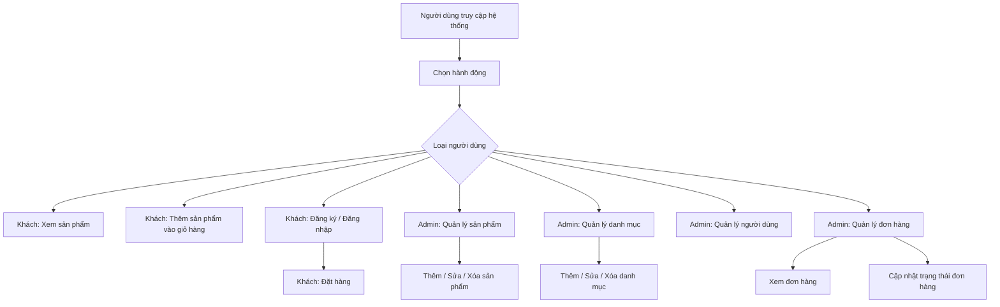

# Hệ Thống Shop Bán Quần Áo

## Được Phát Triển Bởi:
**ĐỖ PHƯƠNG NAM VÀ NGUYỄN ĐÌNH ĐẠT**

## Mô Tả Ứng Dụng
Ứng dụng web shop bán quần áo cho phép người dùng xem sản phẩm, thêm vào giỏ hàng, đặt mua, quản trị viên có thể quản lý người dùng, sản phẩm, danh mục và đơn hàng một cách hiệu quả.

## Mục Đích
- Quản lý thông tin người dùng
- Quản lý thông tin sản phẩm (quần áo)
- Quản lý danh mục sản phẩm
- Quản lý đơn hàng và giỏ 
- Giao diện thân thiện với người dùng
- Hiển thị dữ liệu hiệu quả thông qua DataTables

## Công Nghệ
Dự án sử dụng các công nghệ sau:
- **Laravel Framework** (cập nhật lên phiên bản mới nhất)
- **PHP 8.x**
- **MySQL - Aiven**
- **DataTables với jQuery**
- **AdminLTE 3.x** (giao diện admin)
- **HTML, CSS, JavaScript**
- **Laravel Repository Pattern**
- **Laravel Service Pattern**
- **Laravel Events & Listeners**

## Quá Trình Phát Triển Phần Mềm
### Sơ Đồ Khối (UML) - Cấu trúc Database


### Sơ Đồ Chức Năng (Sơ Đồ Thuật Toán)


## Chu Trình Phát Triển
### Các Giai Đoạn:
1. **Analysis**: Phân tích yêu cầu và thiết kế database
2. **Design**: Áp dụng các design patterns (Repository, Service)
3. **Implementation**: Viết code theo các patterns đã thiết kế
4. **Testing**: Unit tests, Feature tests
5. **Deployment**: CI/CD pipeline

## Deployment
### Cài đặt môi trường
```sh
composer create-project laravel/laravel shop
cd shop
```

### Tạo database
```sql
CREATE DATABASE form;
```

### Cấu hình `.env`
```env
DB_CONNECTION=mysql
DB_HOST=127.0.0.1
DB_PORT=3306
DB_DATABASE=form
DB_USERNAME=root
DB_PASSWORD=
```

### Cài đặt dependencies
```sh
composer require jeroennoten/laravel-adminlte
composer require laravel/ui
```

### Chạy migrations
```sh
php artisan key:generate
php artisan migrate
php artisan db:seed
```

### Deploy lên server
```sh
php artisan serve
```
## Lưu ý về cải tiến cấu trúc
- **Áp dụng Repository Pattern** giúp tách biệt logic truy cập dữ liệu từ controllers.
- **Service Layer** chứa business logic, giúp code dễ test và bảo trì.
- **Request Validation** giúp tách biệt logic validation.
- **API Resources** chuẩn hóa dữ liệu trả về.
- **Events & Listeners** xử lý các tác vụ phụ không đồng bộ.
